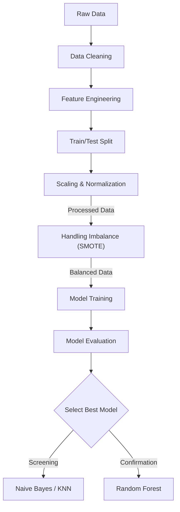

# Predictive Analytics for Hit Songs
This project aims to build Machine Learning models to predict which songs have the potential to become "Hit Songs." By analyzing audio features and metadata from Spotify, this project seeks to assist artists and record labels in planning more effective promotional strategies.

## About the Project
In the highly competitive music industry, identifying high-potential songs early is crucial. This project applies data science techniques to:
- Analyze factors contributing to a song's popularity.
- Address the Imbalanced Data problem, as hit songs are significantly fewer than non-hit songs.
- Compare the performance of various models to determine the best approach.

## Dataset
- Source: Spotify Tracks Dataset (from Kaggle)
- Size: ~114,000 tracks
- Features: Technical audio features such as danceability, energy, valence, acousticness, tempo, loudness, and general metadata like genre, key, mode.
- Target Variable: A new binary variable is_hit was created, where songs with a popularity score > 70 are labeled as Hits (1), and the rest as Non-Hits (0).
- Data processing steps are included in the notebook, utilizing the dataset from [[Kaggle Link]](https://www.google.com/url?q=https%3A%2F%2Fwww.kaggle.com%2Fdatasets%2Fmaharshipandya%2F-spotify-tracks-dataset).

## Workflow
1. Data Cleaning & Preprocessing
- Data Handling: Removed duplicates and handled missing values.
- Filtering: Excluded non-musical genres (e.g., white-noise, asmr, speech) and tracks with abnormal duration or tempo.
- Log Transformation: Applied to skewed features such as duration_ms, liveness, and speechiness.
- Scaling: Used RobustScaler (for data with outliers) and MinMaxScaler.

2. Feature Engineering
- Interaction Features: Created new features like energy_loudness_mul and dance_valence_avg to capture complex relationships between variables.
- Encoding: Converted Genre data to numerical format using Target Encoding (based on the average popularity of each genre).

3. Handling Imbalance
- Since hit songs comprise only ~5% of the dataset, SMOTE (Synthetic Minority Over-sampling Technique) was used to synthesize minority class instances during training, enabling the model to learn the characteristics of hit songs better.

4. Model Training
- The models tested include:
- Naive Bayes: Used as a baseline model.
- K-Nearest Neighbors (KNN): Used to find songs with similar characteristics.
- Random Forest: Used for high accuracy and handling complex data structures.

| Model | Strengths | Weaknesses | Summary |
|-------|-----------|------------|---------|
| **Naive Bayes** | High Recall (Identifies many potential hits) | Low Precision (High False Positive rate) | Suitable for initial broad screening. |
| **KNN** | Easy to interpret | Lower performance with complex features | Produced moderate results in this experiment. |
| **Random Forest (SMOTE)** | **High Precision**, Best F1-Score | Higher computational cost | **The Best Model** for confirming songs to promote. |

## Feature Importance (Random Forest)
Top features that determine a hit song:

| Rank | Feature | Importance | Visualization |
|------|---------|------------|---------------|
| 1 | **Loudness** | High | 🟩🟩🟩🟩🟩🟩🟩🟩🟩🟩 |
| 2 | **Danceability** | High | 🟩🟩🟩🟩🟩🟩🟩🟩⬜⬜ |
| 3 | **Energy** | Med-High | 🟩🟩🟩🟩🟩🟩🟩⬜⬜⬜ |
| 4 | **Acousticness** | Medium | 🟩🟩🟩🟩🟩⬜⬜⬜⬜⬜ |
| 5 | **Valence** | Medium | 🟩🟩🟩🟩⬜⬜⬜⬜⬜⬜ |
